# UCI Mobile App Redesign
---

**PW25 - SE GUI Design and Web Optimization 3 Sem A+B**  

Jane Booysen
53898092

Zingsho Vashum
University of Europe For Applied Sciences

20.01.2026

## Device Chosen
The device chosen for this project is the UCI German Mobile App. United Cinemas International(UCI) is a international film group, in this project I specifaclly am targetting the German version of the app. The app should allow the users to booking tickets for movies at the cinema, see upcoming events, purchase merchandise items and more. The focus of this project will be the home page, which is the first page you see upon opening the app and the pages that follow when booking the movie ticket. 

## Evidence of Design Flaw
The following screenshots illustrates the the flaws with the application

### Problem 1: Cluttered Home Page
Repeated legend and location at each new seaction. The overall strucutre is overwheling with information for the user, making it harder to scan the overall page quickly. Take more time to navigate, leading to frustration
<figure>
  
</figure>
<figure>
  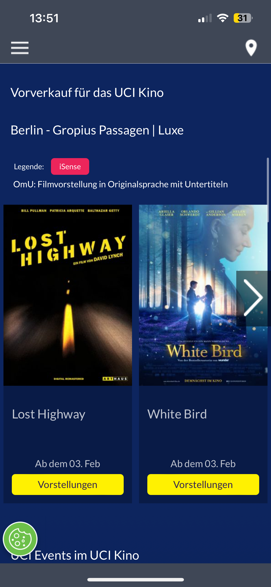
</figure>
<figure>
  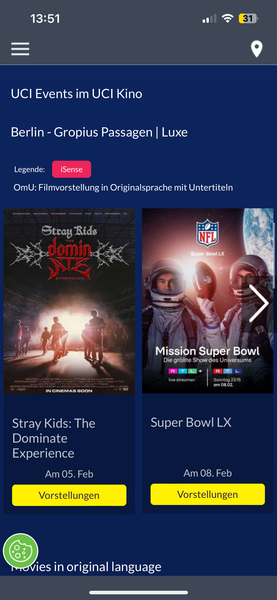
</figure>
<figure>
  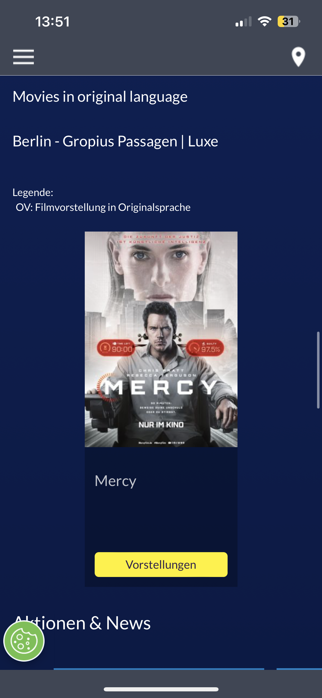
</figure>
<figcaption>Figure 1-4: Home Page</figcaption>

### Problem 2: Lack of Back Button
There is no visual back button resorting in the only ways the user is able to go back is by one of two ways: swipe right on their screen (Figure 5) or open the menu and go back to home (Figure 6)
<figure>
  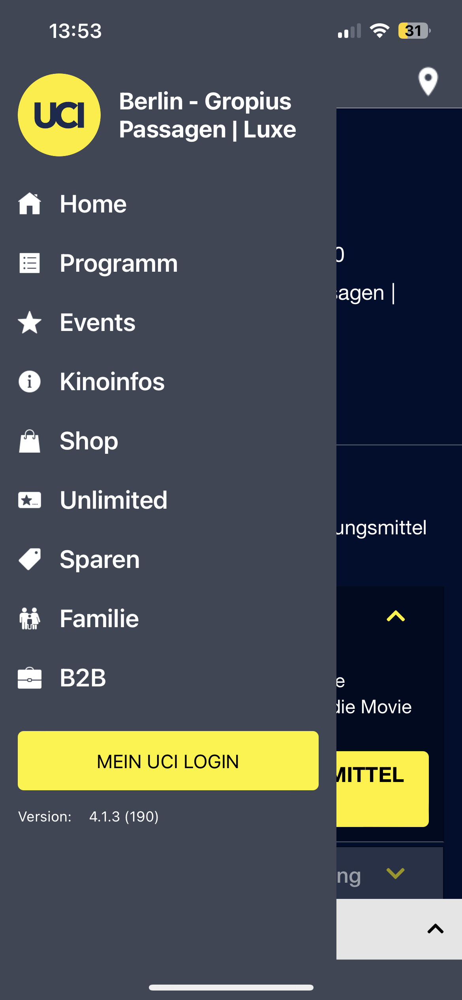
</figure>
<figure>
  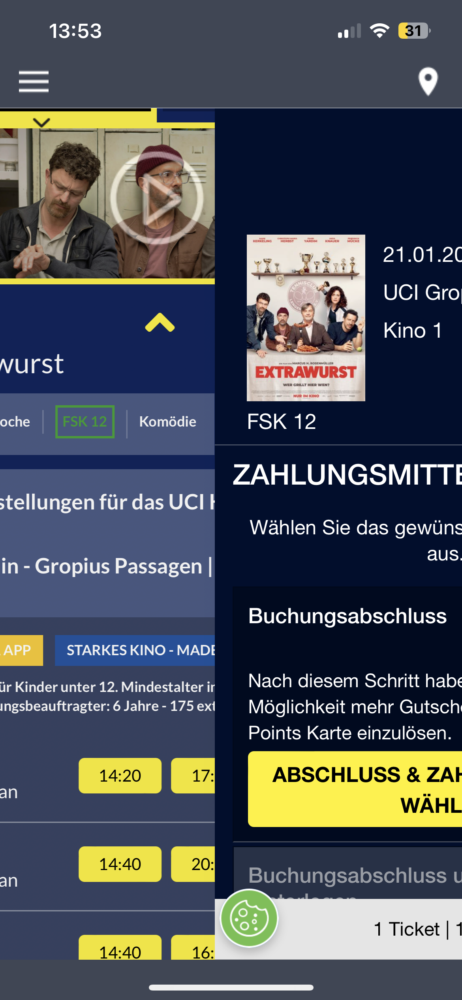
</figure>
<figcaption>Figure 5-6: Back Navigation</figcaption>

### Problem 3: Drop down view to see more information about movie and times
Instead of having a dedicated pages for this, it is all added to a drop down view, which does not automatically close unless user presses up arrow button
<figure>
  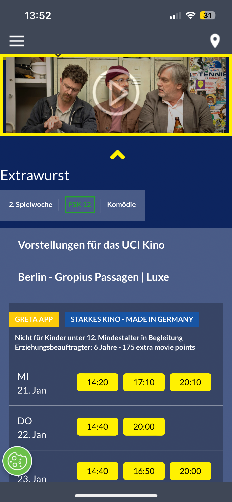
</figure>
<figure>
  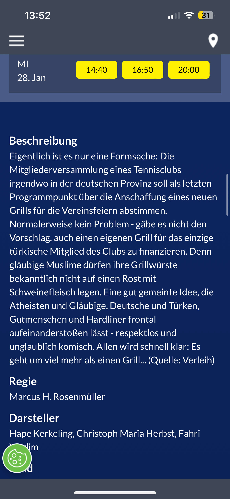
</figure>
<figure>
  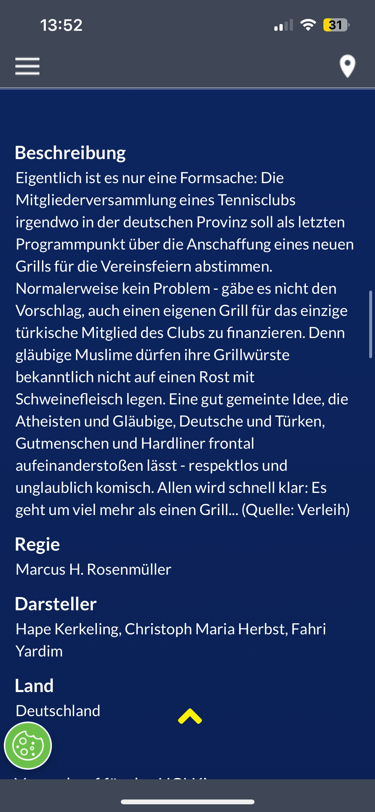
</figure>
<figure>
  
</figure>
<figcaption>Figure 7-11: Dropdown to see more information on movie</figcaption>

### Problem 4: Hierarchy of buttons on Guest Login Page
Right after the user types in the email, their instinct is to press the closest button to them, however that is the Login Button, sending them back to inital page. Additionally, the user often needs to scroll down to see the proper button, making them completely miss it.
<figure>
  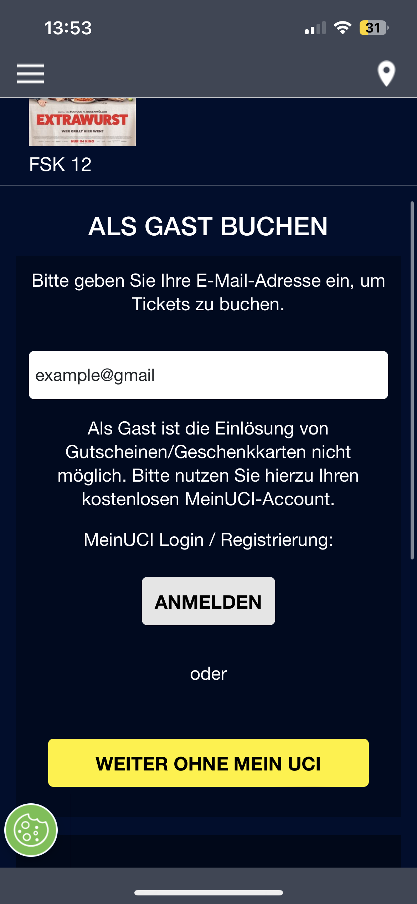
</figure>
<figcaption>Figure 12: Guest Login Page</figcaption>

### Problem 5: Seat Selection Visible even when not accesible 
The Seat Selection is visible on two instances that it is not clear the other things need to be done before the user can access it. One is in the login page, and another is in the ticket selection.
<figure>
  
</figure>
<figure>
  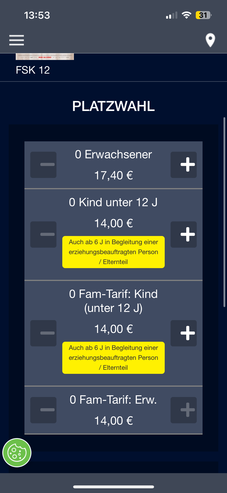
</figure>
<figure>
  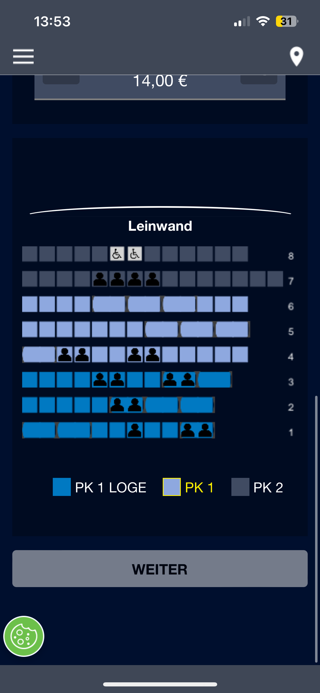
</figure>
<figcaption>Figure 13: Seat Selection Element</figcaption>

### Problem 6: Seat Section has no legend with pricing
It is unclear to the user that there is a price increase between the different seats.
<figure>
  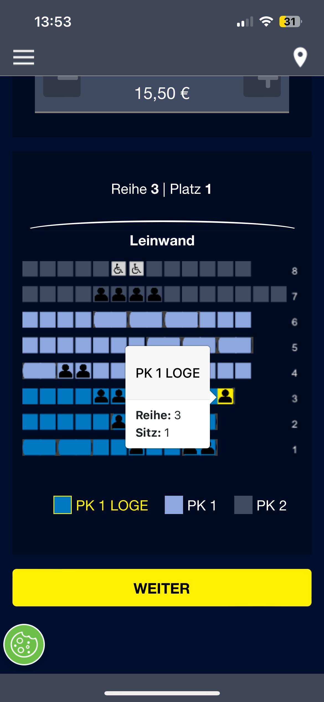
</figure>
<figcaption>Figure 14: Seat Selection without a Legend</figcaption>

## Why This is a Design Flaw
The interface showed a abundance of information, however it was ineffiencet and should have shown the same information but in a more concise manner. Furthermore, it should have allowed the users the felxibilty to navigate between different screen, instead it keeps them stuck on one and having to start all over again if they want to make any changes. The system is also misleading with incorret strucuture of elements such as buttons and seating chart, instead they should have allowed for dedicated screen. 

## Illustrating the Flaw

### Booking a Movie Ticket as a Guest in it's Orginal Language
1. User opens application and faced with cluttered with interface due to uncessary elements, such as the legends before even needing it.
2. Selecting the movie
    - User needs to go through each movie to see the availble time and movies in the orginal language.
    Or
    - Scroll down to the "Orginal Language Movies" section, which its not clear it has that.
3. Taps the down button to see more times for the movie. User faced with dropdown screen which doesn't close, requires user to press up arrow.
4. User selects time, which take them to the login menu.
5. User continues as guest by pressing the "Als Gast Buchen" button, navigating them to a screen to enter their email.
6. User enters their email, and tries to continue by pressing the closest button to the input field, however its the "Anmelden" button and not the "Weither Ohne Mein   UCI". Sending them back to the inital Login screen. Forcing them to go through the processes again.
7. On the same screen as all the login steps they see the seating chart, which doesn't look disabled, but when they try and touch it nothing happens. 
8. Once user has logged in as a guest they experience the same thing with the seating chart, there is no clear layout that makes it obvious they need to select tickets first. 
9. Finally they head to checkout, however they realised they wanted to buy one more ticket, but there is no back button. Their only ways of going back is by swiping the screen right or going to the menu icon and selecting the "Home" section, both these options send the user back to the intial Home screen, forcing them to go through the whole booking process again.

## The Core Task the Interface Should Support
The UCI Mobile app specifically the Home Page and the Booking a Ticket pages, should be able to suppor the following functions:
<ol style="margin-left: 2em;">
    <li>Navigation to different sections on the Home page, these are: Currently showing movies, Coming soon Movies, Original Language Movies, and Events.</li>
    <li>Selecting a movie and time.</li>
    <li>Give information on legend items.</li>
    <li>Allow for user to continue booking as a guest.</li>
    <li>Select a ticket type and seat.</li>
    <li>Get a overview of their purchase before proceeding to payment.</li>
</ol>

## Analysis of Why the Interface Fails

### Structure
<ol style="margin-left: .25em;">
    <li><strong>Section Overload:</strong> On the main screen the the way the different sections are strucutured makes it unclear that there is more section when you scroll. Additionally, it makes it hard to quickly find the different sections, even if you know they are there</li>
    <li><strong>Login before seat preview:</strong> User can't see if there is any good seats they want before they continue with logging in or contining as a guest</li>
    <li><strong>Wrong button proximity:</strong> When user wants to continue as a guest, and the screen navigates to prompt them to enter their email, the "Weiter ohne mein UCI is hidden and not visible in direct view, the user needs to scroll to see it. Instead, right below the input box is the "Anmelden" button. </li>
    <li><strong>Missing back button navigation:</strong> User has no way of going back to a different pages when booking, expect back to the home page, if they swipe the screen.</li>
    <li><strong>Premature Legend Information:</strong> User does not need to see the legend right away when browsing, so taking up uncessary space and making it cluttured.</li>
</ol>

### Sympatics
<ol style="margin-left: .25em;">
    <li><strong>Premature seat chart visibility:</strong> User is unclear how to interact with it before it is active, which is only after they have selected their tickets. </li>
    <li><strong>Order and Process Visual Flow:</strong> The order and requirements are not layed out anywhere, making the user unsure of how many steps are left to book the tickets.</li>
    <li><strong>Hidden Login Requirements:</strong>When clicking the timing button, it's unclear it will force you to sign in before continuing.</li>
</ol>
    
### Feedback
<ol style="margin-left: .25em;">
    <li><strong>Email validation:</strong> When user does not enter a valid email format, it give a invalid email warning, it allows the user to proceed.</li>
    <li><strong>Seat Pricing:</strong> There is no feedback or legend that there is a price increase for the more expensive seats. The only way the user would know about it is, if they scroll up an notice a price increase or decrease.</li>
    <li><strong>No escape routes from dropdown:</strong> The dropdown of the movie times remains open even if you aren't looking at it anymore, forcing the user to manually close it</li>
    <li><strong>Inconsitant disabled state styling</strong>: For the buttons there is disabled state styling, however the color of the seating chart remains unchanged from disabled to active.</li>
</ol>

### System Flow Diagram Before Redesign
<figure>
  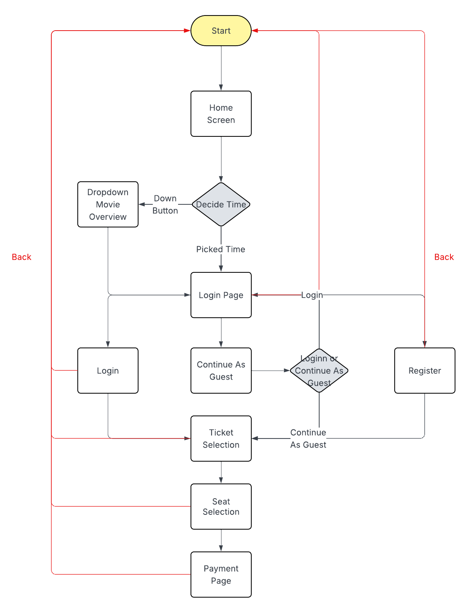
  <figcaption>Figure 15: Flowchart of system before redesign.</figcaption>
</figure>

## Redesign Concept Overview
The proposed improvements focus on creating a clearer, more intuitive booking experience by restructuring navigation, layout, and feedback. A tab menu and progress bar will guide users through clearly defined stages, with separate pages for key steps like seat selection and movie overview to reduce confusion and improve flow. Users can select tickets before being prompted to log in, with a clearly placed “continue as guest” option and the ability to navigate back at any point. Hidden or cluttered information, such as seating legends and pricing, will be made accessible through dedicated screens or information buttons, while proper email validation and clearer seat pricing feedback ensure users understand requirements and costs throughout the process.

### System Flow Diagram After Redesign
<figure>
  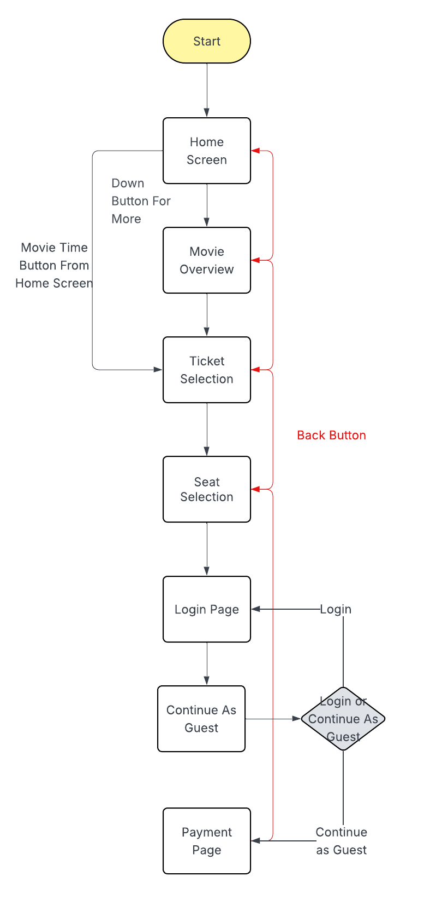
  <figcaption>Figure 16: Flowchart of Redesign.</figcaption>
</figure>

## First Screen Sketch

## Minimum Screens for Final Prototype
In total the Final Prototype will require 7 screens, this is a quick overview of them:
<ol style="margin-left: 0.5em;">
    
1. Home Screen: Overview of what the cinema has to offer. 

    
2. Movie Overview: A dedicate screen for information on the selected movie, and timing options 

    
3. Ticket Selection: A dedicated screen to only selecting the number of tickets the user wants

    
4. Seat Selection: A dedicated screen to selecting seat, with legend support to indicate prices

    
5. Login: Login verfication to make the booking

    
6. Guest Login: To demostrate how the user can continue as a guest

    
7. Order Overview: Overview of the tickets, cost, time and all esentiall information

</ol>

## Expected Design Challanges
<li><strong>Implementing a consistant flow between screen:</strong> One of the most critical flaws with the previous system was that the user couldn't navigate between screen, they could only move forward but not back. Implementing this feature is crutial for improving users experience. However, since adding a dedicated screen for the Movie overview, it will be challanging to detect from the Ticket selection if the users previous page was from the Movie overview or the Home screen. Like in my prototype, if this is not possible to implement in the app, this might be a limitation that the back button could only go back to one page, and not based on users route. </li>
<li><strong>Removing elements but still keeping it informative:</strong> The problem with the existing system is that system give users too much information at each stage, although they are important, it either too repetative or it take away from user experience. So it's important to still have to communicate the information, but it requires restructuring so one piece of information is not repeated througout one single screen. Two specific areas of concern is: 1. Home Page, the header with the location and legend is visible in each section, instead of a page wide information space. 2. Ticket Screen, the information about kids under 6 being able to go without a ticket is repeated twice in different sections. It is important to indicate that it applies to both of those ticket types without typing the same text twice.</li>